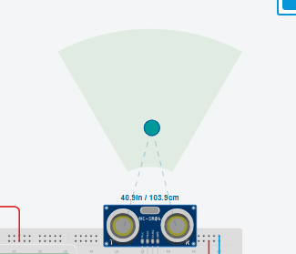

Descrição do Problema
Em áreas propensas a enchentes, o monitoramento contínuo do nível da água é essencial para garantir a segurança da população. Este projeto propõe uma solução de baixo custo utilizando Arduino, sensor ultrassônico e display LCD para medir a altura da água e exibir alertas visuais com base em faixas críticas.

Visão Geral da Solução
A solução consiste em:

Sensor Ultrassônico HC-SR04: mede a distância entre o sensor e o nível da água.

Arduino Uno: processa os dados e calcula a média de múltiplas leituras para maior precisão.

Display LCD 16x2: exibe a distância média e o status do nível da água (baixo, normal, risco de enchente, enchente).

Classificação de risco:

≥ 2.5 m: Nível baixo

1.6 m a 2.49 m: Nível normal

0.8 m a 1.59 m: Risco de enchente

< 0.8 m: Enchente!

ao clicar sobre o sensor ira aparacer esta area verde, arrastando a bolinha sobre ela a distancia da medição sera mudada

video: https://youtu.be/OQmWlugl6T0?si=f5SPeyABXbxam0cV

Simulador: https://www.tinkercad.com/things/lawfHziqQI8/editel?sharecode=o92teLra5fJdC-F1rSz5FrZiw-Gyzvp_VA6t_1fFd5M